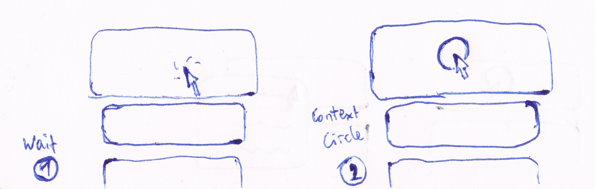
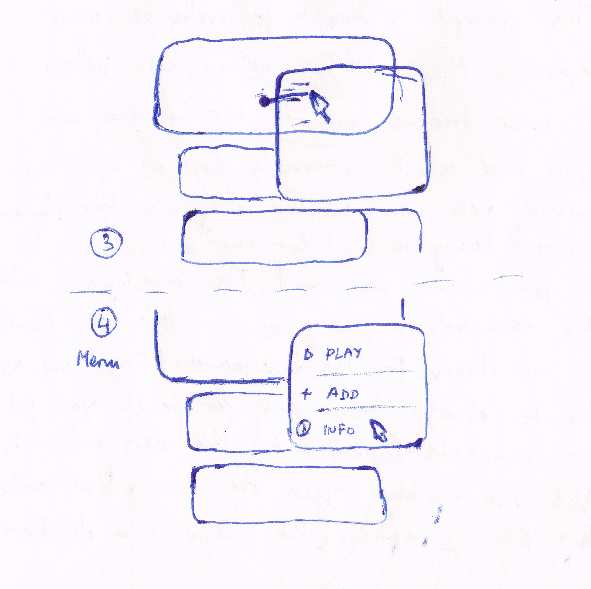
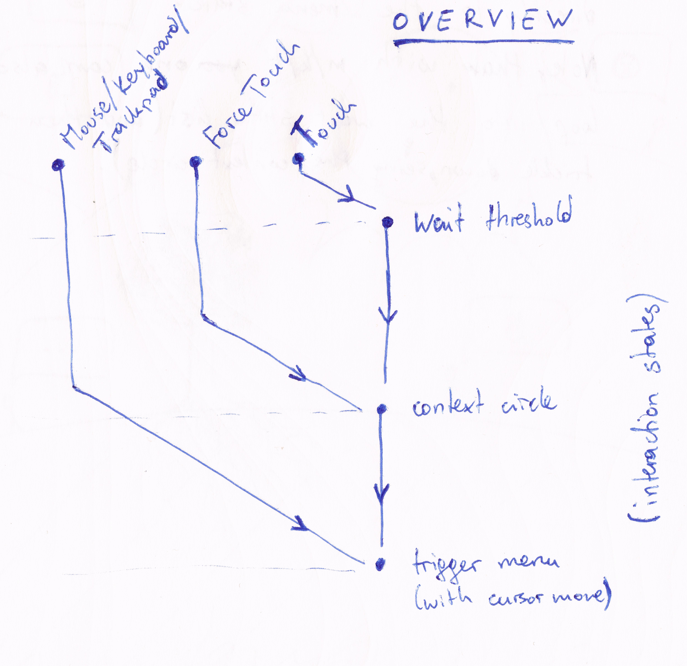

# fluid-menu
Downright awesome menu interaction. WIP.

Fluid Menu is a concept of how a menu interaction (context menus) could work. Its goal is to be

- Intuitive and easy to use
- Fast
- Cross-browser and work with various input types such as mouse, touch, trackpad, keyboard and Force touch
- Have an awesome feedback loop for awesome UX

# The concept

This work is meant to enhance and speedify the workflow of menus. When a user knows how it works he/she can open and select extremely fast. The aim is to put the user action in the foreground of the menu interaction as seen below.

Fluid Menu introduces 4 states. **Idle**, **Wait**, **Context Circle**, **Menu**. Let's see how the workflow could look like:

On an initial click on an element, it gets magnified (1). While still holding down the click, and after a certain threshold if time has passed, the Context Circle shows up, signifying to the user that further action can be taken (2).

When moving the cursor now, the menu will open in the direction of movement (3). The user can now move the mouse/finger over the menu and let go on the option that he/she wants to select (4).

The most important thing is that 1. the Fluid Menu concept gives steady feedback and has logical states and 2. it saves the user from clicks and strokes as will be discussed next.

# Input types

Right now, there are three distinct input type groups for Fluid Menu. **Mouse/Keyboard/Trackpad**, **Force Touch** and **Touch**. The interaction tree for these looks as follows:

As you an see with the flow chart each of these input types allow the user to intercept the interaction at different stages. With Force Touch capabilities, you can skip the Wait state and with the Mouse/Keyboard/Trackpad you can skip Wait *and* Context Circle states.

# Comparison

Thus, this concept eliminates a lot of presses. On Force Touch capable devices, you skip the waiting, on mouse and trackpad devices you save one key-down and one key-up. On touch devices without Force Touch, they get additional feedback by the Context Circle, and get in the center of the interaction because their finger swipe opens the menu, not their waiting. And again, also on touch you save one key-down and one key-up because the finger never leave the screen during the interaction.

But let's see exactly how it compares to normal menus (for simplicity I will only use the word *cursor* for finger, mouse and Force down/up)

Input type | Traditional | Fluid Menu
---------- | ----------- | ----------
**Mouse/Trackpad** | down + up (right-click) - move - down/up | down - move - up
**Force Touch** | down - wait - up - move - down/up | (force) down - move - up
**Touch** | down - wait - up - move - down/up | down - wait - move - up

# Prototype

A prototype is in the works, help is appreciated.
